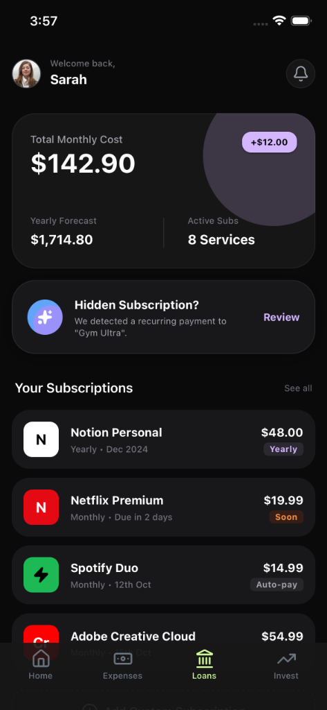

<div align="center">

  <h1>
    
  </h1>

  <p>
    <a href="https://expo.dev">
      
    </a>
    <a href="https://reactnative.dev">
      
    </a>
    <a href="https://www.typescriptlang.org/">
      
    </a>
    <a href="https://tailwindcss.com/">
      
    </a>
    <a href="https://github.com/pmndrs/zustand">
      
    </a>
  </p>

  <p align="center">
    <strong>Fast. Secure. Beautiful.</strong><br />
    The only personal finance tracker you'll ever need.
  </p>

  <br />

  <table border="0">
    <tr>
      <td align="center" width="50%">
        
        <br />
        <p><i>Start Your Financial Journey</i></p>
      </td>
      <td align="center" width="50%">
        
        <br />
        <p><i>Command Center Dashboard</i></p>
      </td>
    </tr>
  </table>

</div>

<br />

## ✨ Features at a Glance

Maximize your financial potential with a suite of powerful tools.

| Status | Feature                  | Description                                                  |
| :----: | :----------------------- | :----------------------------------------------------------- |
|   🟢   | **Smart Dashboard**      | Real-time overview of your net worth, expenses, and savings. |
|   🟢   | **Expense Tracking**     | Lightning-fast logging with categories and tags.             |
|   🟢   | **Loan Manager**         | Track principal, interest, and payoff dates.                 |
|   🟢   | **Investment Portfolio** | Visualize asset allocation and growth over time.             |
|   🟢   | **Emergency Fund**       | Set targets and track progress towards financial safety.     |
|   🚧   | **Goal Planner**         | _Coming Soon:_ Create and track long-term financial goals.   |
|   🚧   | **Cloud Sync**           | _Coming Soon:_ Sync data across devices securely.            |

<br />

## ⚡ Tech Stack

Engineered for performance and developer experience.

| Category       | Technology                 |
| :------------- | :------------------------- |
| **Core**       | React Native, Expo SDK 50+ |
| **Language**   | TypeScript                 |
| **Navigation** | Expo Router (v3)           |
| **Styling**    | NativeWind (Tailwind CSS)  |
| **State**      | Zustand                    |
| **Storage**    | MMKV / AsyncStorage        |
| **Icons**      | Lucide React Native        |

<br />

## 🚀 Quick Start

Get up and running in less than 5 minutes.

### Prerequisites

- **Node.js** (v18+)
- **npm** or **yarn** or **bun**
- **iOS Simulator** (Mac) or **Android Emulator**

### Installation

1.  **Clone the magic**

    ```bash
    git clone https://github.com/yourusername/myfinance.git
    cd myfinance
    ```

2.  **Install dependencies**

    ```bash
    npm install
    # or
    bun install
    ```

3.  **Ignite the app**
    ```bash
    npx expo start
    ```

<br />

## 🏗️ Project Structure

A clean, scalable architecture designed for growth.

```
myfinance/
├── app/                  # 🛤️ File-based routing
│   ├── (tabs)/           # 📑 Main tab navigation
│   ├── _layout.tsx       # 🎨 Root layout definition
│   └── ...
├── src/
│   ├── components/       # 🧩 Atomic UI components
│   │   ├── ui/           # 🧱 Basic building blocks
│   │   └── features/     # ⚙️ Complex functional components
│   ├── constants/        # 📏 Design tokens & config
│   ├── hooks/            # 🎣 Custom React hooks
│   ├── lib/              # 🛠️ Utilities & helpers
│   ├── store/            # 🏪 Global state management
│   └── types/            # 📝 TypeScript definitions
└── assets/               # 🖼️ Static assets
```

<br />

## 🤝 Contributing

Contributions are what make the open-source community such an amazing place to learn, inspire, and create. Any contributions you make are **greatly appreciated**.

1.  Fork the Project
2.  Create your Feature Branch (`git checkout -b feature/AmazingFeature`)
3.  Commit your Changes (`git commit -m 'Add some AmazingFeature'`)
4.  Push to the Branch (`git push origin feature/AmazingFeature`)
5.  Open a Pull Request

<br />

## 📜 License

Distributed under the MIT License. See `LICENSE` for more information.

---

<div align="center">
  <p>
    <a href="https://github.com/yourusername/myfinance/issues">Report Bug</a>
    ·
    <a href="https://github.com/yourusername/myfinance/issues">Request Feature</a>
  </p>
  <p>Made with 💻 & ☕ by <b>Usage</b></p>
</div>
